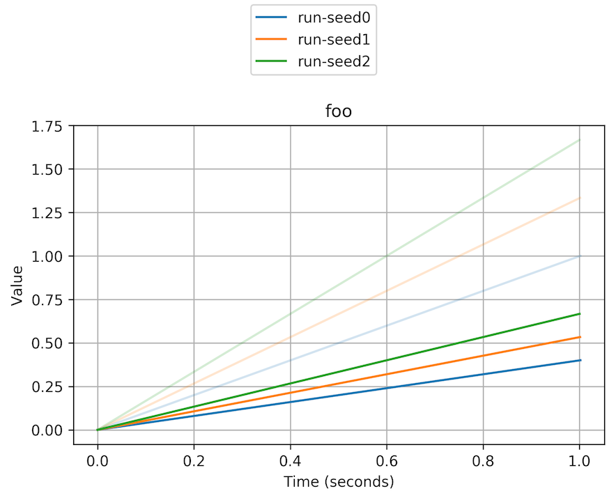

# tbplot

Sometimes TensorBoard can take a really long time to load.

tbplot is a little script to plot and save TensorBoard (scalar) graphs more quickly.
It'll read logs in parallel using as many cores as you have.

## Requirements

* Python >= 3.6 
* Matplotlib
* TensorFlow

## Usage

```
$ tbplot --smoothing 0.6 --n_cols 4 run-seed0 run-seed1 run-seed2
```

(Be careful to supply each run as a separate argument, because tbplot
uses its argument list to determine how to separate runs.
If you do `tbplot .`, it'll get confused.)

You'll now have a file `run-seed*.png` in your current directory:


